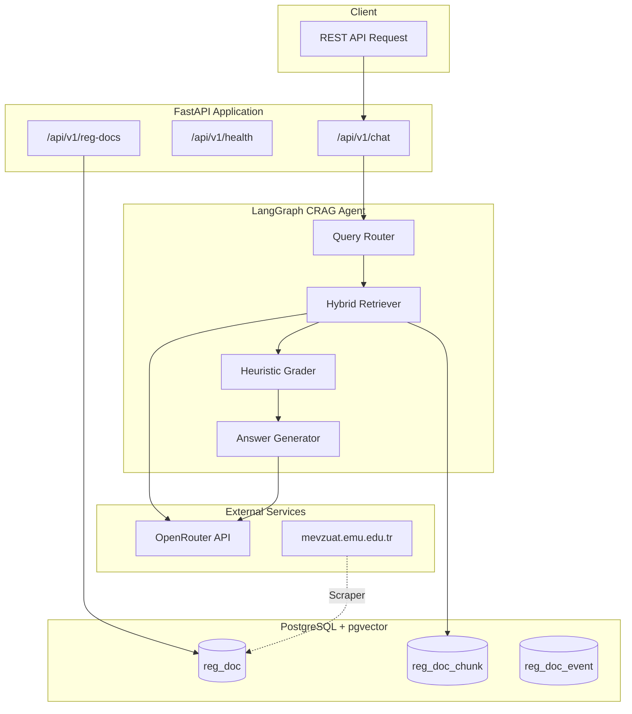
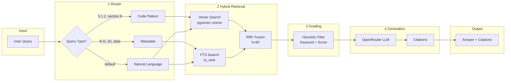
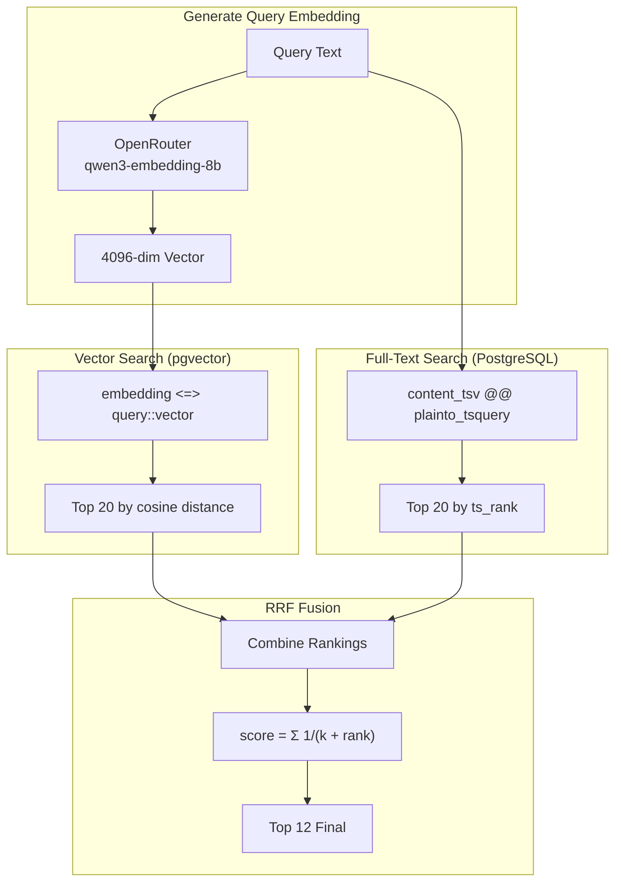
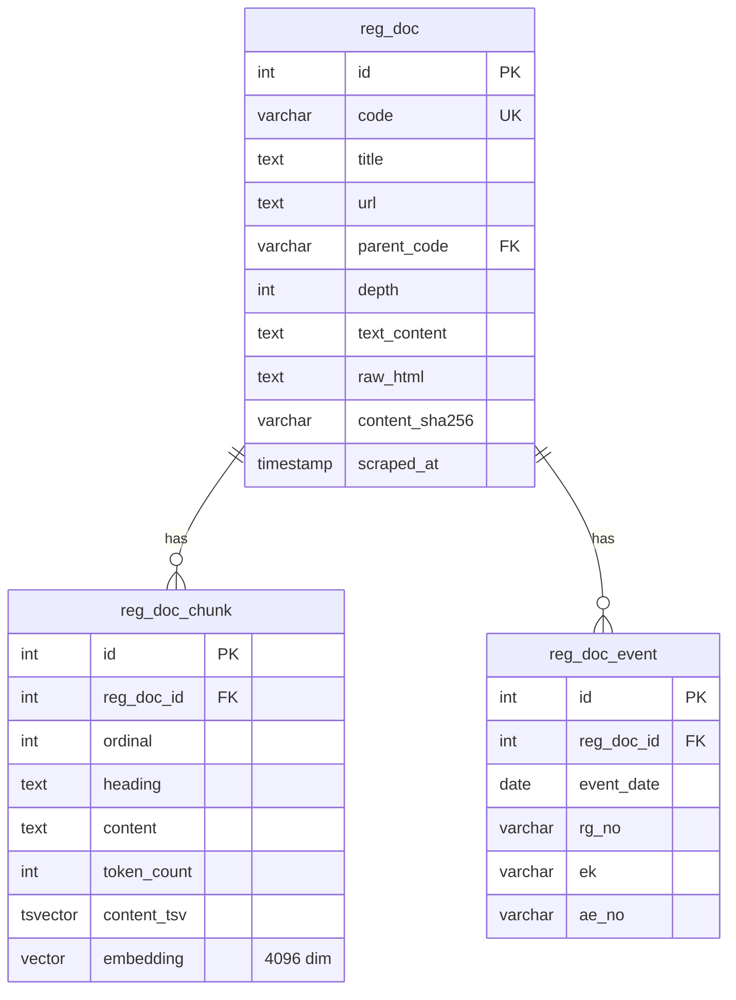

# Mevzuat AI

A production-ready **Retrieval-Augmented Generation (RAG)** system for EMU University regulations, built with **FastAPI**, **LangGraph**, **pgvector**, and **OpenRouter**.

## Features

- **Hybrid Search** - Combines semantic (vector) and keyword (FTS) search with RRF fusion
- **CRAG Agent** - LangGraph-based Corrective RAG with intelligent query routing
- **Web Scraper** - Async scraper for EMU mevzuat regulations
- **PostgreSQL + pgvector** - Scalable vector storage with full-text search
- **Async Everything** - Fully async FastAPI + SQLAlchemy

---

## Architecture Overview



---

## Agent Workflow



---

## Hybrid Search Algorithm



---

## Database Schema



---

## Project Structure

```
mevzuat_ai/
├── app/
│   ├── agent/                 # LangGraph CRAG Agent
│   │   ├── nodes/
│   │   │   ├── router.py      # Query type detection
│   │   │   ├── retrieve.py    # Hybrid vector + FTS search
│   │   │   ├── grade.py       # Heuristic relevance grading
│   │   │   └── generate.py    # LLM answer generation
│   │   ├── tools/
│   │   │   ├── chunker.py     # Text chunking utility
│   │   │   └── embedder.py    # Embedding generation
│   │   ├── config.py          # LLM/embedding configuration
│   │   ├── graph.py           # LangGraph workflow
│   │   └── state.py           # Pydantic state models
│   │
│   ├── api/v1/                # FastAPI endpoints
│   │   ├── chat.py            # /chat - CRAG agent
│   │   ├── reg_docs.py        # /reg-docs - CRUD
│   │   └── health.py          # /health - Status
│   │
│   ├── models/                # SQLAlchemy models
│   ├── schemas/               # Pydantic schemas
│   ├── repositories/          # Data access layer
│   ├── services/              # Business logic
│   ├── config.py              # Pydantic settings
│   └── database.py            # Async SQLAlchemy
│
├── scraper/                   # Standalone web scraper
│   ├── parsers/
│   │   ├── toc.py             # TOC parser
│   │   └── regulation.py      # Page parser
│   ├── orchestrator.py        # Crawl coordinator
│   └── run.py                 # CLI entry point
│
├── scripts/
│   └── embed_documents.py     # Chunking & embedding CLI
│
├── alembic/                   # Database migrations
└── .env                       # Configuration
```

---

## Quick Start

### 1. Prerequisites

- Python 3.10+
- PostgreSQL with pgvector extension
- OpenRouter API key

### 2. Installation

```bash
# Clone and install
cd mevzuat_ai
uv sync

# Configure environment
cp .env.example .env
# Edit .env with your credentials
```

### 3. Database Setup

```bash
# Run migrations
uv run alembic upgrade head

# Note: pgvector extension must be enabled by a superuser:
# CREATE EXTENSION IF NOT EXISTS vector;
```

### 4. Scrape & Embed

```bash
# Start server in one terminal
uv run uvicorn app.main:app --reload

# Run scraper in another terminal
uv run python -m scraper.run

# Generate embeddings
uv run python -m scripts.embed_documents
```

### 5. Test the Agent

```powershell
$body = '{"query":"What are the graduation requirements?"}'
Invoke-WebRequest -Uri http://localhost:8000/api/v1/chat `
  -Method POST -Body $body `
  -ContentType "application/json" -UseBasicParsing
```

---

## API Endpoints

| Method | Endpoint | Description |
|--------|----------|-------------|
| `POST` | `/api/v1/chat` | Query the CRAG agent |
| `GET` | `/api/v1/chat/health` | Agent status |
| `GET` | `/api/v1/health` | DB connectivity |
| `GET` | `/api/v1/reg-docs/` | List documents |
| `GET` | `/api/v1/reg-docs/{id}` | Get by ID |
| `POST` | `/api/v1/reg-docs/upsert` | Insert/update |

### Chat Request

```json
{
  "query": "What are the disciplinary procedures?"
}
```

### Chat Response

```json
{
  "answer": "The disciplinary procedures are set out in...",
  "citations": [
    {"reg_code": "5.2", "chunk_id": 14, "excerpt": "..."}
  ],
  "confidence": 0.8,
  "has_sufficient_evidence": true
}
```

---

## Configuration

```bash
# .env file
DATABASE_HOST=localhost
DATABASE_PORT=5432
DATABASE_NAME=mevzuatai_dev
DATABASE_USER=mevzuat_ai
DATABASE_PASSWORD=your_password

# OpenRouter
OPENROUTER_API_KEY=your_key
OPENROUTER_BASE_URL=https://openrouter.ai/api/v1
LLM_MODEL=google/gemini-2.0-flash-exp:free
EMBEDDING_MODEL=qwen/qwen3-embedding-8b
EMBEDDING_DIM=4096
```

---

## Technical Details

### Hybrid Search Implementation

The retriever combines **vector similarity** and **full-text search** using **Reciprocal Rank Fusion**:

```python
# Vector search with pgvector
(c.embedding <=> '{embedding}'::vector) as vec_distance
ORDER BY c.embedding <=> '{embedding}'::vector

# FTS search with PostgreSQL
ts_rank(c.content_tsv, plainto_tsquery('english', :query)) as fts_score
WHERE c.content_tsv @@ plainto_tsquery('english', :query)

# RRF combination
rrf_score = 1/(k + vec_rank) + 1/(k + fts_rank)
```


